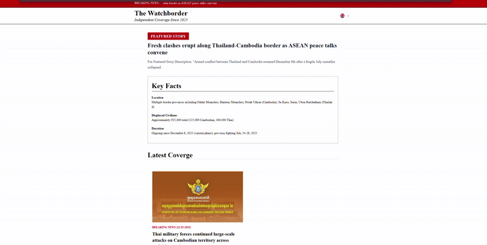
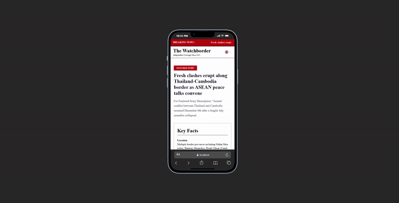
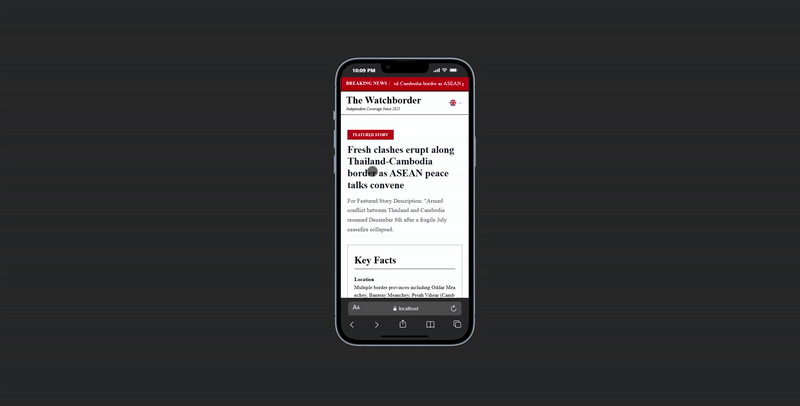
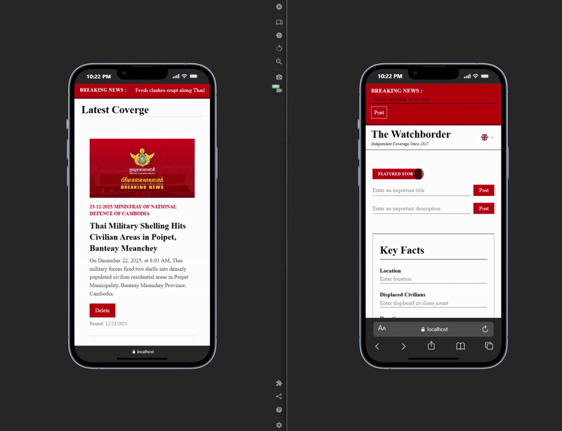
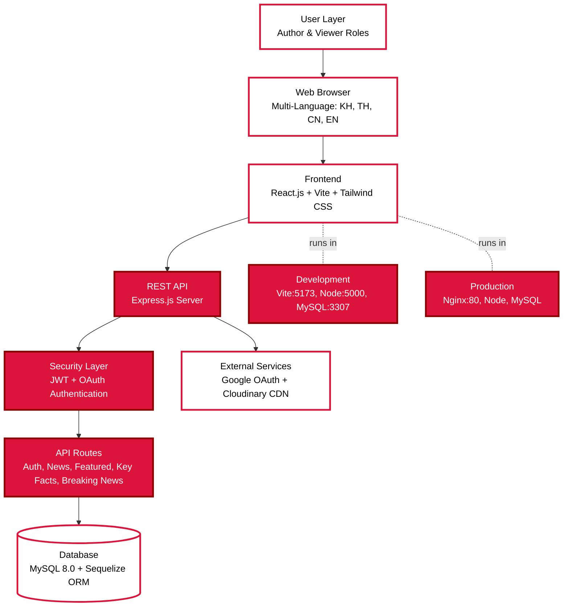

# Watch Border - Cambodia-Thailand Border News Platform

A professional full-stack web application providing real-time news and updates about the Cambodia-Thailand border situation. Built with modern technologies and containerized with Docker for seamless deployment.

## Overview

Watch Border is dedicated to delivering accurate, timely information about the Cambodia-Thailand border by gathering verified sources from official channels including the Ministry of Defense of Cambodia, Thailand, Malaysia, and other authoritative governmental bodies. Our mission is to provide transparent, multilingual coverage of border developments to a global audience.

---

## Live Demo

### Authentication System

*Secure user registration and login with Google OAuth integration*

### Multi-Language Support

*Seamless language switching between Khmer, Thai, Chinese, and English*

### Viewer Interface

*Clean, intuitive interface for readers to browse news and updates*

### Author Dashboard

*Powerful content management system for authors to create and publish articles*

---

## Multi-Language Support

Watch Border supports **4 languages** to ensure accessibility for diverse audiences:

| Language | Native Name | Flag |
|----------|-------------|------|
| **Khmer** | ភាសាខ្មែរ | 🇰🇭 |
| **Thai** | ภาษาไทย | 🇹🇭 |
| **Chinese** | 中文 | 🇨🇳 |
| **English** | English | 🇬🇧 |

Users can seamlessly switch between languages using the flag selector in the navigation menu.

---

## System Architecture

**Architecture Overview:**

A streamlined top-to-bottom flow demonstrating user interaction with the Watch Border platform through multiple secure layers, from browser interface to database persistence, with Docker containerization supporting both development and production environments.

---

## Tech Stack

### Frontend
- **React.js** - Modern UI framework for building responsive interfaces
- **Tailwind CSS** - Utility-first CSS framework for rapid styling
- **Vite** - Next-generation frontend build tool
- **React Router** - Declarative routing for React applications
- **Axios** - Promise-based HTTP client

### Backend
- **Express.js** - Fast, unopinionated Node.js web framework
- **MySQL 8.0** - Robust relational database management system
- **Sequelize ORM** - Promise-based Node.js ORM for MySQL
- **JSON Web Token (JWT)** - Secure authentication mechanism
- **Cloudinary** - Cloud-based image and video management

### DevOps & Infrastructure
- **Docker** - Container platform for consistent environments
- **Docker Compose** - Multi-container application orchestration
- **Nginx** - High-performance production web server and reverse proxy

---

## Key Features

### Content Management
- Multi-language news article publishing
- Breaking news message
- Key facts documentation
- Rich media support with Cloudinary integration

### User Management
- Role-based access control (Author & Viewer)
- Google OAuth integration
- JWT-based secure authentication
- Session management

### Source Verification
We gather verified information from official sources including:
- Ministry of Defense of Cambodia
- Ministry of Defense of Thailand
- Ministry of Defense of Malaysia
- Other authoritative governmental agencies
- Verified international organizations

---

## Author

**Pisey Khenchandara**
- GitHub: [@piseyKhenchandara](https://github.com/piseyKhenchandara)
- Email: piseykhenchandara93@gmail.com
- LinkedIn: [Connect with me](https://linkedin.com/in/pisey-khenchandara)

---

## Acknowledgments

- Built to inform the global community about Cambodia-Thailand border developments
- Special thanks to all contributors and supporters
- **Cloudinary** for reliable cloud-based media management
- **Google Cloud Platform** for OAuth authentication services
- Official governmental sources for verified information
- Open-source community for excellent tools and libraries

---

## Support

For support, questions, or feedback:
- Open an issue on [GitHub Issues](https://github.com/piseyKhenchandara/watch-border/issues)
- Email: piseykhenchandara93@gmail.com
- Submit feedback through the platform's contact form

---

**Watch Border** - Bringing transparency to border news, one update at a time.